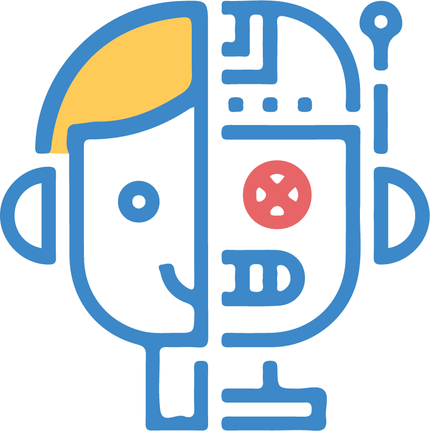

# APIA (AI Powered Interview Assistant)
This project aims to create a simulated interview system utilizing AI techniques to assess an individual’s performance in a chosen field. The system involves an AI-driven avatar functioning as an interviewer, asking the user questions relevant to their selected field. Additionally, the system incorporates eye tracking and facial emotion recognition to gauge the user’s emotional state during the interview, potentially detecting feelings of anxiety or other emotions.
At the conclusion of the session, the system provides the user with a performance score based on their responses and emotional cues. This innovative approach to performance assessment offers a dynamic and interactive platform for individuals to hone their interview skills and receive personalized feedback. The project not only focuses on the technical implementation of AI and emotion recognition but also explores the potential impact on enhancing interview preparation and assessment processes.

[The Website Demo](https://drive.google.com/file/d/1a_EmIPf1lw7Ttl-WB0WEhgUhot781uD9/view?usp=sharing) <br>
[The Graduation Book](https://drive.google.com/file/d/18PJN8PoZZ1-woMVTLHT9PddspmTGBv2c/view?usp=sharing) <br>
[The Presentation](https://prezi.com/view/78qfufFrv7M4xo6GXkhA/)

## Run the website

### Frontend

Go to client folder

```bash
  cd client/
```

Install Dependencies

```bash
  npm install --force
```

Start the server

```bash
  npm start
```

### Backend

Go to flask-server folder

```bash
  cd flask-server/
```

Install Dependencies

```bash
  pip install -r requirements.txt
```

Start the server

```bash
  python server.py
```

### Add the face emotion recognition model

[Download the FER model](https://drive.google.com/drive/folders/1_8ox7L8bhRSS_Fi7MBXvGWJw-ubpt9id?usp=sharing) <br>

Put them in this folder

```bash
  cd flask-server/Fer/model
```

### Contributers
Maryam Abdou <br>
Farah Elgendy <br>
Shams Zayan <br>
Ingy Hany <br>
Youstina Hanna <br>
Youmna Elmezayen
